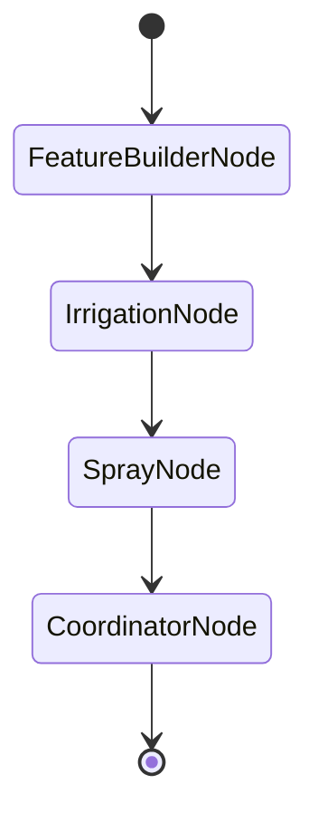

# Vinea — Agronomic Decision Agents 🍇

_"Should I irrigate? Can I spray?"_ — a small **Pydantic AI** app that turns hourly
vineyard weather into a daily, grower-facing advisory for **tomorrow** via a graph of
three agents (Irrigation, Spray, and a Coordinator that *reconciles* them).

It is also a **teaching repository**. The one idea it exists to argue is:

> **Where do you draw the LLM ↔ deterministic boundary?**
> The vineyard physics — ETc = ET₀ × Kc, a running water balance, Delta-T and wind
> bands, spray-window detection — is computed in **plain Python**. The LLM is a
> bounded *judgement-and-explanation* layer over those numbers. It never does
> arithmetic it would hallucinate, and every number it emits is grounded in a real
> input, enforced by output validators.

## Built in 13 phases

Each phase is one commit with a tag, and one lesson in [`docs/phases/`](docs/phases/).
So you can read the argument in order, or jump into the code at any stage:

```bash
git checkout phase-04     # the project as it stood at "robustness"
uv run pytest             # green here, and at every other tag
git checkout main
```

| # | Phase | Lesson | Idea |
|---|---|---|---|
| 1 | Scaffold & ingestion | [01](docs/phases/01-scaffold-and-ingestion.md) | Validate at the edge; missing stays missing |
| 2 | The deterministic core | [02](docs/phases/02-deterministic-core.md) | FAO-56 water balance + spray gates, in Python |
| 3 | Three agents on a graph | [03](docs/phases/03-agents-and-graph.md) | The topology *is* the boundary; reconcile ≠ concatenate |
| 4 | Robustness | [04](docs/phases/04-robustness.md) | Data quality as a confidence **ceiling** |
| 5 | The design essay | [05](docs/phases/05-the-design-essay.md) | Write the argument before building it |
| 6 | Persistence | [06](docs/phases/06-persistence.md) | Store what you cannot recompute |
| 7 | A second source | [07](docs/phases/07-second-source.md) | New source = new adapter, core untouched |
| 8 | Batch & queue | [08](docs/phases/08-batch-and-queue.md) | `SKIP LOCKED`, and one owner per retry |
| 9 | Observability | [09](docs/phases/09-observability.md) | A span *tree*, not flat logs |
| 10 | API | [10](docs/phases/10-api.md) | Enqueue and read; never run a model in the request |
| 11 | Dashboard | [11](docs/phases/11-dashboard.md) | The UI may only speak HTTP |
| 12 | Prompt registry & eval gate | [12](docs/phases/12-prompts-and-evals.md) | Deterministic oracles beat an LLM judge |
| 13 | Containerize & deploy | [13](docs/phases/13-containerize-and-deploy.md) | Code and schema cannot move atomically |
| 14 | LLM gateway & cost | [14](docs/phases/14-gateway-and-cost.md) | A budget in the wrong unit is worse than none |
| 15 | Retrieval & citations | [15](docs/phases/15-rag-and-citations.md) | Retrieval feeds the explanation, never the computation |
| 16 | Context engineering | [16](docs/phases/16-context-engineering.md) | Check what the instrument measures before quoting it |

The production layers do not reach into the core built in phases 1–4. That is a
checkable claim, not a slogan — and worth checking *precisely*, because which files
are exempt is the interesting part:

```bash
# Unchanged from phase 4 all the way to phase 16 — the physics, the contracts,
# the crop config, the topology, the conflict facts, the orchestration entry:
git diff --ignore-blank-lines phase-04 phase-16 -- \
  src/vinea/features.py src/vinea/contracts.py src/vinea/deps.py \
  src/vinea/graph.py src/vinea/reconcile.py src/vinea/pipeline.py     # empty

# Additive only — not one line removed:
git diff phase-04 phase-16 -- src/vinea/ingest.py src/vinea/config.py

# Genuinely changed, and you should expect these to be:
git diff phase-04 phase-16 -- src/vinea/agents.py src/vinea/cli.py
```

`agents.py` changes in phase 12, when the instruction f-strings become registry
lookups. `cli.py` gains flags (`--source`). `ingest.py` grows `assemble_load_result`
for the second source in phase 7, removing nothing. **The physics and the topology
never move** — which is the claim that matters, stated narrowly enough to be true.

(`--ignore-blank-lines` because adopting ruff in phase 6 dropped one blank line from
`features.py`. That single blank line is the entire diff.)

## Run in one command

```bash
uv run vinea                  # full LLM advisory (needs one provider API key)
uv run vinea --features-only  # deterministic FarmFeatures only — no LLM, no key
```

`uv` resolves + installs (from `uv.lock`) and runs — no manual venv activation. The full
advisory calls the LLM, so it needs one provider key (copy `.env.example` → `.env`). **With no
key set, it automatically falls back to `--features-only`** (the deterministic core), so the
one command always produces output.

Useful flags:

```bash
uv run vinea --run-date 2026-07-28          # which 'today' the advisory is for
uv run vinea --json                         # dump JSON instead of the human summary
uv run vinea --data-dir ./data              # where the two CSVs live
uv run vinea --history PATH --forecast PATH # override CSV paths
uv run vinea --source api                   # live Open-Meteo instead of the CSVs (phase 7)
```

### What the deterministic layer reports on the committed data

Run date 2026-07-28, advising about **2026-07-29**, Nemea:

```
[irrigation]
  current depletion : 133.5 mm  (RAW trigger 67.5 mm, TAW 150.0 mm)
  cumulative ETc    : 137.98 mm   (Kc=0.7)
  tomorrow ETc/rain : 5.26 mm / 0.0 mm
  -> should irrigate (mechanical trigger): True  depth 133.5 mm

[spray]
  bands tomorrow    : {'ideal': 11, 'marginal': 4, 'unsuitable': 9}
  window  00:00-10:00  — 10h suitable (Delta T ideal×10; wind ok; rain-fast)
  window  21:00-00:00  — 3h suitable (Delta T marginal×3; wind ok; rain-fast)
```

Every number there is checkable by hand. 197.11 mm of ET₀ over 30 days × Kc 0.70 =
**137.98 mm** ETc; minus 5.6 mm of rain at the 0.80 effective fraction (4.48 mm) =
**133.5 mm** of depletion — nearly double the 67.5 mm trigger, and still inside TAW,
so the `[0, TAW]` clamp is not what sets it.

Tomorrow's spray day is gated by **Delta-T**: nine hours (11:00–19:00) exceed the
10 °C ceiling, and wind brackets them at 10:00 and 20:00 (6.45 and 5.37 m/s, over
the 4.2 m/s drift limit). Note that midday violates *both* — the reported reason is
the first gate in a fixed order, not the only violation. What survives is a long
overnight block and a short late-evening one; the pre-dawn hours of the first window
are dark (GHI = 0 until ~06:00), which is exactly the kind of judgement the Spray
Agent is there to make and the Coordinator to sequence.

## Architecture — the 3-agent graph



`load_weather` (I/O, kept at the edge) → **`FeatureBuilderNode` (DETERMINISTIC — no model)** →
`IrrigationNode` → `SprayNode` → `CoordinatorNode` (LLM) → `DailyFarmAdvisory`. The graph topology
*is* the LLM/deterministic boundary: Python computes the physics; the agents are a bounded
judgement-and-explanation layer with typed outputs, dynamic `@agent.instructions` (crop config via
`deps`), and `@agent.output_validator` grounding guards (e.g. the irrigation agent must copy
`current_depletion_mm` verbatim; spray windows must be a subset of the deterministic candidates;
the coordinator must embed both sub-advices unchanged). The Coordinator *reconciles* (sequences the
day + `conflicts_resolved`) rather than concatenating. Crop = injected `Deps`, so a new crop/region
is a config change, not a code change.

## Data

The two CSVs in `data/` are **committed on purpose** — the suite runs offline and the
numbers above are checkable, and neither is true if the data must be fetched first.

Weather data by [Open-Meteo.com](https://open-meteo.com/) (**CC BY 4.0**), captured for
Nemea, Corinthia on 2026-07-28: 720 hourly history rows + 168 forecast rows, no missing
cells. `scripts/fetch_dataset.py` is the exact call that produced them.

See **[`data/ATTRIBUTION.md`](data/ATTRIBUTION.md)** for provenance, the two derived
columns (Delta-T, and the cm→mm snowfall fix), why there is no vendor spray index, and
what regenerating the data costs you.

## Model

Configured via `VINEA_MODEL` (any Pydantic AI `provider:model` string), default
`anthropic:claude-sonnet-4-5`. Copy `.env.example` → `.env` and set the matching key
(`ANTHROPIC_API_KEY` / `OPENAI_API_KEY` / `GEMINI_API_KEY`). The SDK reads the key from
the environment — **no key is stored in code**, and `.env` is gitignored.

## Key decisions (phase 1)

- **`uv` + `src/` layout** — one tool for lock + run = a genuine one-command README;
  `src/vinea/` keeps imports unambiguous. Single-file would also be fine at this size.
- **CSVs committed to `data/`** — a freely-licensed capture with its provenance and its
  fetch script beside it. The load path stays a CLI/env **parameter**, so data is never
  baked into logic.
- **Timezones: tz-naive, site-local** — CSV timestamps carry no offset, so they parse as
  naive `datetime` and are treated as the same local wall-clock zone as `run_date`
  (Peloponnese). UTC normalization is deferred (`# TODO`). Mixing a UTC series with a local
  `run_date` would skew `staleness_hours`.
- **Missing/non-finite cells become `None`, not crashes** — empty/`NaN`/`inf` cells are
  coerced to `None` so they can't silently poison the running water balance; the loader
  counts them (`nan_cells`, plus `spray_critical_nan_cells` for Delta T / wind) and lowers
  confidence. In phase 2 a missing spray-critical hour is **excluded** from windows (never
  fabricated) and a missing ET₀ hour is **skipped** (not zero-filled).
- **Staleness is surfaced, not hidden** — this capture is fresh (it ends at yesterday
  23:00, so `confidence_penalty` is 0.0), but the mechanism is real and is covered by
  `tests/fixtures/fixture_stale.csv`. Advice must be grounded in fresh data; staleness
  lowers confidence rather than failing.

## Agronomic assumptions (phase 2) — injected via `Deps` (`src/vinea/deps.py`)

All tunables are **injected**, not hard-coded — a new crop/region is a one-object change
(`grep "0.7"` finds Kc only as the `Deps` default). The reference crop is mature
drip-irrigated wine grapes (*Vitis vinifera*), Peloponnese, post-veraison.

| Parameter | Value | Why |
|---|---|---|
| `kc` | **0.70** | FAO-56 Table 12 Kc-mid, wine grapes (data: 197.11 mm ET₀ → 137.98 mm ETc) |
| `taw_mm` | **150 mm** | total available water, ~0.125 × 1.2 m loam root zone |
| `mad_fraction` (p) | **0.45** → RAW **67.5 mm** | management-allowed depletion = the irrigation trigger |
| `initial_depletion_mm` | **0** | t=0 assumption: soil at field capacity at history start |
| `effective_rain_fraction` | **0.80** | rest lost to interception/runoff (5.6 mm rain → 4.48 mm credited) |
| `rain_skip_mm` | **5 mm** | skip irrigation if effective forecast rain ≥ this |
| Delta-T bands | **2 / 8 / 10 °C** | BoM: <2 inversion · 2–8 ideal · 8–10 marginal · >10 unsuitable |
| wind ideal | **0.83–4.2 m/s** | BoM 3–15 km/h band |
| `spray_index` | **absent in this data** | an optional external 0–100 score; no free source publishes one, the gate fails **open** without it, and physics decides. See [ATTRIBUTION](data/ATTRIBUTION.md#no-vendor-spray-index) |
| `rain_fast_hours` | **2 h** | dry interval needed after application |
| no runoff / deep drainage | **assumed** | excess above field capacity is discarded by the `[0, TAW]` clamp |
| deficit-irrigation stance | **judgement** | the deterministic layer emits only the mechanical RAW/MAD *trigger*; the partial-refill / hold-off call is left to the agent |

**Key phase-2 decisions:** the **water balance & spray-window detection are pure Python**
(`features.py`) — the LLM (phase 3) only *judges and explains*, never computes. Depletion is
**clamped to [0, TAW]**; because the dataset has no irrigation log, `current_depletion_mm` is
an upper-bound atmospheric signal (a note flags this). Missing ET₀ hours are **skipped, not
zero-filled** (and counted). Deficit irrigation is left as a **judgement for the agent**.

## Robustness & tests

- **Confidence is bounded by data quality.** `DataQuality.confidence_penalty` (gaps, NaN/inf,
  spray-critical gaps, staleness) sets a deterministic ceiling that each agent's `confidence` is
  **clamped** to — the model can't claim certainty over degraded inputs — and the gap is surfaced
  as a caveat in the rationale/summary. Missing hours are **excluded, never fabricated** (NaN
  Delta-T hours drop out of spray windows; missing ET₀ hours are skipped, so depletion is a lower
  bound).
- **Output validators as guardrails.** `@agent.output_validator` raises `ModelRetry` (bounded by
  `retries=2`) when the LLM drifts off the deterministic ground truth — irrigation must echo the
  computed depletion and not over-fill past field capacity; spray windows must be a subset of the
  deterministic candidates; overall confidence can't exceed the most confident leg. On exhausted
  retries the CLI degrades to the deterministic features rather than crashing.
- **Tests run fully offline — no live model:**

  ```bash
  uv run pytest      # 115 passed, 65 skipped (the skips need Postgres)
  uv run ruff check
  ```

  `tests/conftest.py` sets `ALLOW_MODEL_REQUESTS = False` as a hard backstop; agents are exercised
  via `TestModel` / `FunctionModel` + `Agent.override`, and the deterministic physics is unit-tested
  against hand-checked numbers and the real CSVs (cumulative ETc ≈ 137.98 mm, the water-balance
  clamp, Delta-T band edges, window collapsing).

  The DB-backed tests **skip** rather than fail when no Postgres is reachable — a red suite that
  means "you didn't start Docker" trains people to ignore red. `docker compose up -d postgres`
  and they run; CI starts the service and gets no skips.

## The design essay

**[`DESIGN.md`](DESIGN.md)** was written at phase 5, *before* phases 6–12 were built: scaling
(**B1** — overnight batch fan-out, deterministic-feature model routing, the double-retry footgun,
autoscale on queue depth not CPU, per-tenant budgets & EU residency); monitoring & evaluation
(**B2** — span-tree tracing, and the differentiator: **deterministic ground-truth oracles** scoring
the LLM with asymmetric, recall-gated costs, as both an inline guardrail and an async eval); and
prompt management without redeploying (**B3** — `name@label` registry, stale-while-revalidate
cache, and the fail-open **registry-down → bundled-default** path that never errors a grower's
request).

## Architecture decisions

Five ADRs record the calls that were genuinely arguable:

| ADR | Decision |
|---|---|
| [001](docs/adr/001-store-what-you-cannot-recompute.md) | Store what you cannot recompute |
| [002](docs/adr/002-new-source-new-adapter.md) | New source = new adapter |
| [003](docs/adr/003-postgres-queue-not-redis.md) | Postgres queue, not Redis |
| [004](docs/adr/004-self-hosted-langfuse.md) | Self-hosted Langfuse |
| [005](docs/adr/005-streamlit-not-react.md) | Streamlit, not React |
| [006](docs/adr/006-kubernetes-on-demand.md) | Kubernetes, provider-agnostic and on demand |
| [007](docs/adr/007-self-hosted-gateway-exact-cache.md) | A self-hosted LLM gateway, exact-match cache |
| [008](docs/adr/008-pgvector-not-a-vector-database.md) | pgvector, not a vector database; hybrid retrieval |

## Layout

```
src/vinea/  config · ingest · deps · contracts · features        the deterministic core
            reconcile · agents · graph · pipeline · cli           agents + wiring
            db/         schema, mapping, repository               phase 6
            sources/    WeatherSource protocol, CSV + Open-Meteo  phase 7
            jobs/       queue, scheduler, worker, degraded path   phase 8
            obs/        tracing, instrumented run                 phase 9
            api/        FastAPI, auth, schemas                    phase 10
            ui/         Streamlit app + panels                    phase 11
            prompts/    name@label registry, cache, drift check   phase 12
            evals/      oracles, asymmetric scoring, golden, judge phase 12
            gateway/    routing, ledger, budget refusals            phase 14
            rag/        corpus, embedding, hybrid store, citations   phase 15
            context/    token accounting, the per-leg budget          phase 16
data/       the two CSVs + ATTRIBUTION.md
            corpus/  798 passages of FAO-56, CC BY 4.0          phase 15
scripts/    fetch_dataset.py — regenerates data/ from Open-Meteo
            fetch_corpus.py  — and data/corpus/ from FAO       phase 15
Dockerfile  two targets: `app` (API + worker) and `ui`               phase 13
            --build-arg GATEWAY=1 adds the OpenAI-wire SDK (+30 MB)  phase 14
            --build-arg RAG=1 bakes the embedding model (391→649 MB) phase 15
infra/      chart/ Helm · tofu/ the paid path · kind-e2e.sh          phase 13
            chart/files/litellm-config.yaml — one file, two deploys  phase 14
            sealed-secrets/ · testing/ the throwaway Postgres
docs/       adr/ · phases/ — the eight decisions and the sixteen lessons
migrations/ Alembic versions (the schema we actually ship)
tests/      offline via TestModel/FunctionModel · fixtures/
```

## Licence

Code: MIT (see [LICENSE](LICENSE)). Bundled weather data: CC BY 4.0, Open-Meteo — see
[`data/ATTRIBUTION.md`](data/ATTRIBUTION.md).
