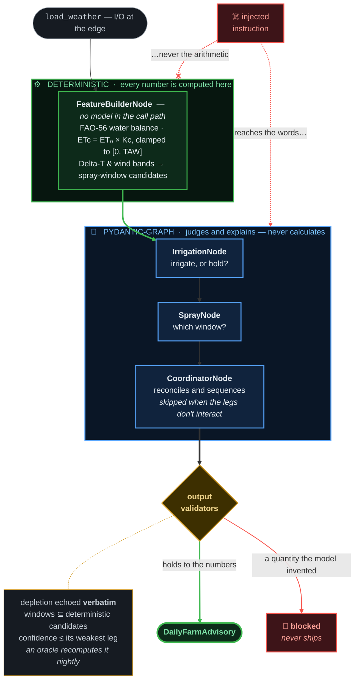

# Vinea 🍇

**Should I irrigate? Can I spray?** — a daily, grower-facing advisory for tomorrow,
produced overnight from hourly vineyard weather.

Every night the system computes a FAO-56 water balance and a spray-window analysis
for each block, then uses a small graph of LLM agents to judge the borderline calls,
sequence the day, and explain itself in language a vineyard manager can act on. The
advisory is available before work starts.

```
[irrigation]  Irrigate 133.5 mm — depletion is nearly double the 67.5 mm trigger.
[spray]       Do not spray 11:00–19:00: Delta-T above 10 °C. Window 00:00–10:00.
[summary]     Irrigate after sunset. Spray in the pre-dawn window before it warms.
```

## The one design constraint

**Every number is computed in plain Python. The model judges and explains; it never
calculates.**

`ETc = ET₀ × Kc`, the running water balance clamped to `[0, TAW]`, the Delta-T and
wind bands, the spray-window detection — all of it in `features.py`, with no model
in the call path. The agents receive finished numbers and are held to them by output
validators: the irrigation agent must echo the computed depletion verbatim, spray
windows must be a subset of the deterministically computed candidates, and overall
confidence cannot exceed its most confident leg.

Three things follow, and they are why the constraint is worth the discipline:

- **An advisory cannot contain a hallucinated quantity.** A wrong number fails
  validation before it ships, and an independent oracle recomputes it in the
  nightly eval.
- **It is also the security boundary.** A prompt injection cannot change a value it
  cannot reach — see [SECURITY.md](SECURITY.md), which shows a model *scripted to
  obey* an injection failing to ship the fabricated figure.
- **It has not needed to move.** `tests/test_core_unchanged.py` compares the parsed
  AST of those six files against the day they were written. Persistence, a queue, an
  API, a UI, a prompt registry, an eval gate, containers, Kubernetes, an LLM
  gateway, retrieval, row-level security and SLOs were all built on top without
  reaching in.

## Quickstart

```bash
uv run vinea                  # full advisory (needs one provider API key)
uv run vinea --features-only  # the deterministic layer only — no model, no key
```

`uv` resolves, installs from `uv.lock`, and runs. With **no** key set it degrades to
`--features-only` automatically, so the command always produces output.

```bash
uv run vinea --run-date 2026-07-28   # which "today" to advise from
uv run vinea --json                  # JSON instead of the human summary
uv run vinea --source api            # live Open-Meteo instead of the committed CSVs
```

Copy `.env.example` → `.env` and set one of `ANTHROPIC_API_KEY`, `OPENAI_API_KEY`,
`GEMINI_API_KEY`. `VINEA_MODEL` takes any Pydantic AI `provider:model` string and
defaults to `anthropic:claude-sonnet-4-5`. No key is stored in code; `.env` is
gitignored.

### What it reports on the committed data

Run date 2026-07-28, advising about 2026-07-29, Nemea:

```
[irrigation]
  current depletion : 133.5 mm  (RAW trigger 67.5 mm, TAW 150.0 mm)
  cumulative ETc    : 137.98 mm   (Kc=0.7)
  tomorrow ETc/rain : 5.26 mm / 0.0 mm
  -> should irrigate (mechanical trigger): True  depth 133.5 mm

[spray]
  bands tomorrow    : {'ideal': 11, 'marginal': 4, 'unsuitable': 9}
  window  00:00-10:00  — 10h suitable (Delta T ideal×10; wind ok; rain-fast)
  window  21:00-00:00  — 3h suitable (Delta T marginal×3; wind ok; rain-fast)
```

Every number is checkable by hand. 197.11 mm of ET₀ over 30 days × Kc 0.70 =
**137.98 mm** of ETc; minus 5.6 mm of rain at the 0.80 effective fraction (4.48 mm)
= **133.5 mm** of depletion — nearly double the 67.5 mm trigger, and still inside
TAW, so the `[0, TAW]` clamp is not what sets it.

Tomorrow's spray day is gated by **Delta-T**: nine hours (11:00–19:00) exceed the
10 °C ceiling, and wind brackets them at 10:00 and 20:00 (6.45 and 5.37 m/s, over
the 4.2 m/s drift limit). Midday violates *both* — the reported reason is the first
gate in a fixed order, not the only violation. What survives is a long overnight
block and a short late-evening one, and the pre-dawn hours of the first are dark
(GHI = 0 until ~06:00) — which is the judgement the spray agent is there to make and
the coordinator to sequence.

## Architecture



The topology *is* the boundary. Crop parameters arrive as an injected `Deps`, so a
new crop or region is a configuration row rather than a code change. The coordinator
*reconciles* — it sequences the day and records `conflicts_resolved` — rather than
concatenating the two legs, and it is skipped entirely on nights where the legs do
not interact and the data is clean.

| Layer | What it does |
|---|---|
| `features.py`, `contracts.py`, `deps.py` | the agronomy, and the typed contracts around it |
| `graph.py`, `agents.py`, `reconcile.py` | three agents, their validators, the conflict facts |
| `db/`, `migrations/` | Postgres: advisories, weather, config, the queue, the corpus |
| `jobs/` | the overnight batch: `SELECT … FOR UPDATE SKIP LOCKED`, retries, reaper |
| `api/` | FastAPI. Enqueues and reads; never runs a model |
| `ui/` | Streamlit, over HTTP only |
| `gateway/` | optional LLM gateway: routing, failover, cost capture |
| `rag/` | FAO-56 retrieval for citations, full-text |
| `slo/`, `obs/` | objectives measured in SQL, tracing, cost accounting |

## Agronomy

All tunables are injected via `Deps` (`src/vinea/deps.py`). The reference crop is
mature drip-irrigated wine grapes (*Vitis vinifera*), Peloponnese, post-veraison.

| Parameter | Value | Why |
|---|---|---|
| `kc` | **0.70** | FAO-56 Table 12 Kc-mid, wine grapes |
| `taw_mm` | **150 mm** | total available water, ~0.125 × 1.2 m loam root zone |
| `mad_fraction` (p) | **0.45** → RAW **67.5 mm** | management-allowed depletion = the irrigation trigger |
| `initial_depletion_mm` | **0** | soil at field capacity at the start of history |
| `effective_rain_fraction` | **0.80** | the rest is lost to interception and runoff |
| `rain_skip_mm` | **5 mm** | skip irrigation if effective forecast rain ≥ this |
| Delta-T bands | **2 / 8 / 10 °C** | BoM: <2 inversion · 2–8 ideal · 8–10 marginal · >10 unsuitable |
| wind ideal | **0.83–4.2 m/s** | BoM 3–15 km/h band |
| `spray_index` | **absent in this data** | an optional vendor 0–100 score; the gate fails **open** without it and physics decides |
| `rain_fast_hours` | **2 h** | dry interval needed after application |

Two stances worth knowing. Depletion is clamped to `[0, TAW]` and, with no irrigation
log in the data, `current_depletion_mm` is an upper-bound atmospheric signal — a note
on the advisory says so. And the deterministic layer emits only the mechanical
RAW/MAD *trigger*; whether to partially refill or hold off is left to the agent,
because that is a judgement about this season and this block.

**Missing stays missing.** Empty, `NaN` and `inf` cells become `None` rather than
zero, are counted (`nan_cells`, and `spray_critical_nan_cells` for Delta-T and wind),
and lower confidence. A missing spray-critical hour is *excluded* from windows, never
fabricated; a missing ET₀ hour is *skipped*, never zero-filled.
`DataQuality.confidence_penalty` sets a ceiling each agent's confidence is clamped
to, so the model cannot claim certainty over degraded inputs.

## Data

Two CSVs in `data/`, committed on purpose: the suite runs offline and the numbers
above are checkable, and neither is true if the data has to be fetched first.

Weather by [Open-Meteo](https://open-meteo.com/) (**CC BY 4.0**), Nemea, Corinthia,
captured 2026-07-28 — 720 history rows, 168 forecast rows, no missing cells.
`scripts/fetch_dataset.py` is the exact call that produced them.

`data/corpus/` holds 798 passages of **FAO Irrigation and Drainage Paper 56**
(CC BY 4.0, [doi:10.4060/cd6621en](https://doi.org/10.4060/cd6621en)) for citations.
`scripts/fetch_corpus.py` regenerates it and **verifies the licence** against FAO's
repository API before writing — an attribution claim that lives only in a Markdown
file is one nobody rechecks.

See [`data/ATTRIBUTION.md`](data/ATTRIBUTION.md) for full provenance.

## Deploy

One Helm chart, provider-agnostic, four workloads: the API, the Streamlit UI, the
nightly worker CronJob, and a migration hook that must succeed before any new pod
serves traffic.

```bash
./infra/kind-e2e.sh --cleanup   # create a cluster, deploy, smoke-test, tear down
helm upgrade --install vinea infra/chart --set image.tag=…
```

Postgres is managed and external — the advisories are the one thing that cannot be
recomputed, and they do not belong on the newest component in the system. It needs
`pgvector/pgvector:pg16` or equivalent; the stock `postgres:16` cannot create the
`vector` extension the schema declares.

`infra/tofu/` provisions the paid path (GKE + Cloud SQL, EU-only by a validation
rule). CI validates it and never plans or applies.

## Operations

Three objectives, measured in SQL over rows the system already stores:

| Objective | Target | Window |
|---|---|---|
| advisory available by 06:00 **local** | ≥ 99% of tenant-days | 30 days |
| p95 `GET /advisories/{tenant}/{run_date}` | < 300 ms | 7 days |
| advisories from the deterministic path | < 5% | 7 days |

```bash
python -m vinea.slo report        # the table, with error budgets
python -m vinea.slo check         # exit 1 on a breach; records it
python -m vinea.context           # what is actually in each prompt
python -m vinea.rag search "…"    # what a citation lookup returns
python -m vinea.jobs work         # drain the queue by hand
```

The error budget is stated in advance, because one chosen after the first breach is a
number chosen to excuse it: **99% over 30 tenant-days is 0.3 permitted misses.** One
bad night spends a tenant's month. Budget remaining → ship; budget spent → stop
shipping changes to the nightly path.

Three [runbooks](docs/runbooks/), one per alert, each answering what is broken, what
to check first, what to do — including *nothing* — and what waiting costs against the
budget. The degraded-rate objective never pages: nothing is broken for a grower when
it breaches, and waking someone for a correct answer is how a rota learns to ignore
its pager.

## Tracing

One trace per advisory, showing the graph's node spans and the agents' model calls
in one tree — and `FeatureBuilderNode` visibly has no model call beneath it.

```bash
docker compose --profile langfuse up -d
export LANGFUSE_HOST=http://localhost:3000 \
       LANGFUSE_PUBLIC_KEY=pk-lf-local-vinea \
       LANGFUSE_SECRET_KEY=sk-lf-local-vinea
uv run pytest tests/test_langfuse_live.py -v   # exports a trace and reads it back
```

Self-hosted (ADR-004) with `include_content=False`, so span payloads record *that*
a model was called, its cost and its version — never the prompts, which carry
depletion figures and block locations. Unset the three variables and no exporter is
built: `trace_id` stays NULL and advisories are produced as before.

[docs/deploy-langfuse.md](docs/deploy-langfuse.md) has the cluster path.

## Security

Tenant isolation is enforced by Postgres row-level security, not by application
code: every connection runs as a non-superuser role, and a query that forgets its
`WHERE tenant = …` returns **nothing** rather than everything. A session that
declares no scope at all sees nothing, so forgetting is the safe direction.

CI fails on any known dependency vulnerability and scans the built image. See
[SECURITY.md](SECURITY.md) for the model, its limits, and what it deliberately does
not do.

## Testing

```bash
uv run pytest        # 199 passed, 103 skipped — the skips need Postgres
uv run ruff check .
```

Fully offline by default. `ALLOW_MODEL_REQUESTS = False` is a hard backstop; agents
are exercised with `TestModel`/`FunctionModel` and `Agent.override`, and the physics
is checked against hand-verified numbers and the real CSVs.

Database tests **skip** rather than fail without Postgres — a red suite meaning "you
didn't start Docker" trains people to ignore red. Same for the four tests that need a
live service:

| what is running | result |
|---|---|
| nothing | 199 passed, 103 skipped |
| Postgres | 303 passed, 4 skipped |
| Postgres + Langfuse | 306 passed, 1 skipped *(the last needs an LLM gateway)* |

CI starts Postgres and gets no database skips.

## Decisions

Eleven ADRs, each with its rejected alternatives and the trigger that would reverse
it. One has been reversed, by measurement.

| | |
|---|---|
| [001](docs/adr/001-store-what-you-cannot-recompute.md) | Store what you cannot recompute |
| [002](docs/adr/002-new-source-new-adapter.md) | New source = new adapter |
| [003](docs/adr/003-postgres-queue-not-redis.md) | Postgres queue, not Redis |
| [004](docs/adr/004-self-hosted-langfuse.md) | Self-hosted Langfuse |
| [005](docs/adr/005-streamlit-not-react.md) | Streamlit, not React |
| [006](docs/adr/006-kubernetes-on-demand.md) | Kubernetes, provider-agnostic and on demand |
| [007](docs/adr/007-self-hosted-gateway-exact-cache.md) | A self-hosted LLM gateway, exact-match cache |
| [008](docs/adr/008-pgvector-not-a-vector-database.md) | pgvector, not a vector database *(hybrid half superseded by 011)* |
| [009](docs/adr/009-row-level-security.md) | Tenant isolation in the database, not in the queries |
| [010](docs/adr/010-slos-in-sql.md) | SLOs measured in SQL |
| [011](docs/adr/011-lexical-retrieval-only.md) | Lexical retrieval only — reversing 008's hybrid |

ADR-004 and ADR-010 carry amendments rather than rewrites: 010 recorded "Langfuse
not deployed" as a *permanent* debt and that ruling has been retracted, because
"permanent" was a judgement about cost rather than a fact about the system.

ADR-011 is the one worth reading first. Hybrid retrieval was chosen on a measured
recall of 1.00, then a harder question set showed lexical search alone scored **0.78
against the hybrid's 0.70** — the weak embedder was displacing correct results. A
larger model was measured before reversing and bought one question out of 27. The
dense half was deleted and the image lost 258 MB.

## Layout

```
src/vinea/  features · contracts · deps · reconcile     the agronomy
            graph · agents · pipeline · cli             agents and wiring
            db/       schema, mapping, repository, RLS scoping
            sources/  WeatherSource protocol, CSV + Open-Meteo
            jobs/     queue, scheduler, worker, degraded path
            obs/      tracing, instrumented run
            api/      FastAPI, auth, schemas
            ui/       Streamlit panels
            prompts/  name@label registry, cache, drift check
            evals/    oracles, asymmetric scoring, golden replay
            gateway/  routing, cost ledger, budget refusals
            rag/      corpus, chunk store, queries, citations
            context/  token accounting, per-leg budget
            slo/      objectives, SLIs in SQL, error budgets
            security.py  bounded free text (not an injection filter)
data/       two CSVs + corpus/ + ATTRIBUTION.md
scripts/    fetch_dataset.py · fetch_corpus.py
infra/      chart/ Helm · tofu/ the paid path · kind-e2e.sh · sealed-secrets/
docs/       adr/ · runbooks/ · engineering-log/
migrations/ Alembic versions (the schema actually shipped)
tests/      offline by default; fixtures/
```

## How it was built

[`docs/engineering-log/`](docs/engineering-log/) records the build in eighteen
entries, in order, with the reasoning and the mistakes kept in. Each is a tagged
commit — `git checkout phase-07` gives the project as it stood there, green.

It is history rather than documentation, and several decisions in it were later
reversed. The reversals are marked where they happened; entries are not edited to
look right in hindsight.

[`CONTRIBUTING.md`](CONTRIBUTING.md) has the working rules, including what must not
change without an ADR.

## Licence

Code: MIT ([LICENSE](LICENSE)). Bundled weather data and the FAO-56 corpus: CC BY
4.0 — see [`data/ATTRIBUTION.md`](data/ATTRIBUTION.md).
